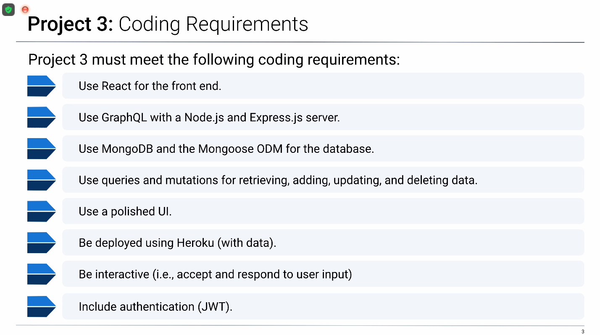

# 22 Final Project: Dungeons and Dragon Character Generator

## Our Task 

Dungeons and Dragons (DnD) can be a complex and intimidating game with stats, spells, equipment and the like. Our App aims to create a simple unified solution to guide your DnD experience. Our Challenge is to use the Dungeon and Dragon's API to create a web application where users can create a character with skills, equipment, spells, inventory!

## Technologies Used

Express.js - to build our app and routing purposes
MongoDB - for a flexible scalable database
GraphQL - to query and fetch data from our database 
React - on the front end 

**include any NPM packages here as well* 

We'll be deploying this program to Application to Heroku.

## User Story

```md
AS A new player to Dungeons and Dragons
I WANT a simplified app that can guide me through character creation and game-play
SO THAT I can easily learn and integrate into the game.
```

## Acceptance Criteria

```md
Profile: 
WHEN I enter the page I’m prompted to log in or sign up
THEN I enter info and am logged in or an account is created
WHEN I view my profile
THEN I see my username, characters, options to create/update characters
WHEN I press logout
THEN I’m taken back to the landing page
WHEN I choose a character
THEN I am taken to that characters initial page

NavBar: 
WHEN I look to the top of the page
THEN I see a NavBar that lets me path to Profile/Character/Skills/Equipment/Spells/Inventory
WHEN I click on one of the nav links
THEN a page presenting that information is rendered

Character:
WHEN I am creating a character
THEN I am presented with prompts to input my character information (Race/Class/Skills/etc.)
WHEN I am done creating a Character
THEN I am taken to that Characters initial page
WHEN I view my character page
THEN  I see my character name, img, background, flaws, bonds, and a nav bar.


Skills:
WHEN I go to the Skills page
THEN I am presented with Ability Scores/Modifiers, skills/proficiencies
WHEN I am on the Skills page
THEN I also see my class skills, and features.
WHEN I want to add new skills/features
THEN I am able to click on an edit/update icon to add more.
WHEN I finish editing skills/features
THEN I can click on a save icon to update them.

Equipment:
WHEN I go to the equipment page
THEN I am presented with ability modifier tied to fighting style, as well as weapons/items i can use to interact with the game
WHEN I view my weapons
THEN I am presented with dmg type, roll modifier, and damage dice
WHEN I view other interactable items
THEN I am presented with brief descriptions on how I can use them

Spells:
WHEN I go to the spells page
THEN I am presented with spells my character has learned
WHEN I click on a spell
THEN a tooltip pops up and shows spell information.
WHEN I am on the spells page
THEN I can see my spell-save dc/spellcasting modifier

Inventory:
WHEN I go to the inventory page
THEN I am shown all of my items I own
WHEN I want to update item count
THEN I have options to edit and save item counts
WHEN I want to add a new item to my inventory
THEN I have a button that allows me to add a new item
WHEN I press said button 
THEN I can either choose an item that exists in dnd, or create my own
```

# Getting Started (must still be modified)

Establish our API routes/endpoints and Models in this section to ensure a shared understanding among team members 
while maintaining an accurate vision of the final product. 

## Models

### User

-  `username`
    - String
    - Unique
    - Required
    - Trimmed

-  `email`
    - String
    - Required
    - Unique
    - Must match a valid email address

-  `password`
    - String
    - Required
    - Trimmed
  
-  `id`
    - Integer
    - Unique
    - Required

### Character

-  `name`
    - String
    - Required
    - Trimmed
-  `race`
    - String
    - Required
    - Trimmed
-  `Origin Story/Background`
    - String
    - Required
    - Trimmed
-  `Skills`
    -  Array
-  `Spells`
    - Array
-  `items`
    - Array

## Routes

Here are the possible routes for Dundrag.com:

### Auth Routes

- `POST /api/signup` - Creates a new user account
- `POST /api/login` - Logs in an existing user

### Profile Routes (Locked with withAuth) 

- `GET /profile` - Gets the profile page for the logged-in user
- `POST /characters` - Creates a new character for the logged-in user
- `GET /characters` - Gets all characters for the logged-in user
- `GET /:characterId/bio` - Gets the bio information for a specific character
- `GET /:characterId/skills` - Gets the skills for a specific character
- `GET /:characterId/spells` - Gets the spells for a specific character
- `GET /:characterId/items` - Gets the items for a specific character

### Logout Route

- `GET /api/logout` - Logs out the current user


* `GET` all users

* `GET` a single user by its `_id` and populated thought and friend data

* `POST` a new user:

```json
// example data
{
  "username": "lernantino",
  "email": "lernantino@gmail.com"
}
```

* `PUT` to update a user by its `_id`

* `DELETE` to remove user by its `_id`

**BONUS**: Remove a user's associated characters when deleted.


## Grading Requirements 



\- Research tooltips, DnD 5e api, graphQL/Mongoose integration, look at other dnd apps and see how they work.
